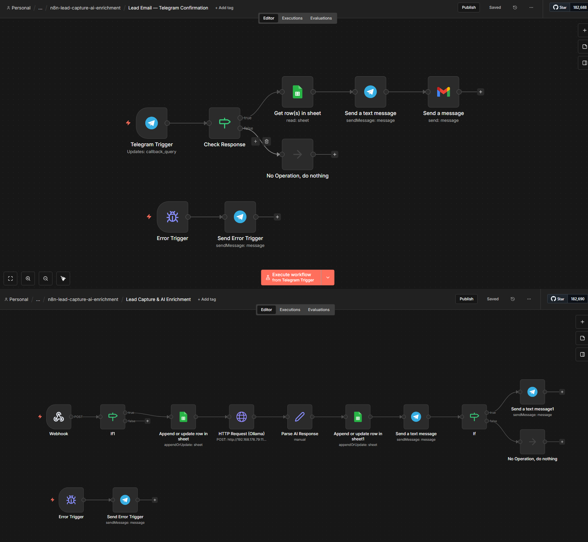
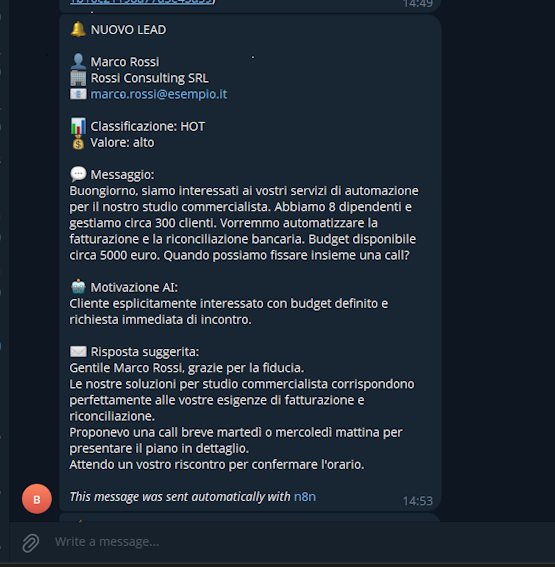
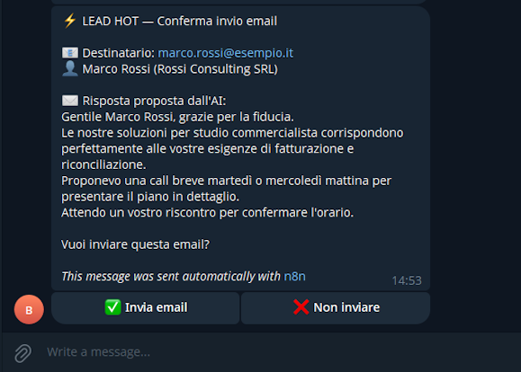

# n8n Lead Capture & AI Enrichment

> Automated lead capture pipeline with AI-powered lead scoring, 
> Telegram notifications, and human-in-the-loop email approval.



## What it does

When a potential client submits a contact form:

1. **Capture** — Lead data is saved to Google Sheets
2. **Analyze** — Local AI (Ollama) classifies the lead as hot/warm/cold 
   and drafts a personalized response
3. **Enrich** — Google Sheets is updated with AI classification 
   and suggested response
4. **Alert** — Sales team gets a Telegram notification with full summary
5. **Approve** — If lead is "hot", team can approve the AI-drafted 
   email with one tap on Telegram
6. **Respond** — Approved email is sent via Gmail automatically

## Screenshots

### Telegram notification with lead summary


### Approval buttons for hot leads


## Architecture

### Workflow 1: Lead Capture & AI Enrichment (9 nodes)
```
Webhook (POST /lead-capture)
  → Google Sheets (save raw data)
    → HTTP Request → Ollama (classify lead)
      → Set (parse AI response)
        → Google Sheets (update with AI data)
          → Telegram (alert team)
            → If (hot?)
              → Telegram (approval buttons)
```
### Workflow 2: Email Confirmation Handler (6 nodes)
```
Telegram Trigger (button callback)
  → If (send_email?)
    → Google Sheets (lookup lead data)
      → Telegram (confirm sent)
        → Gmail (send AI-drafted response)
```

## Key features

- **Human-in-the-loop** — No email sent without explicit human approval 
  via Telegram inline buttons
- **Local AI** — Uses self-hosted Ollama (qwen3.5:9b), zero API costs, 
  full data privacy
- **Structured AI output** — JSON-forced output with classification, 
  motivation, suggested response, estimated value
- **Full audit trail** — Every lead + AI analysis saved in Google Sheets
- **Decoupled workflows** — Two separate workflows for reliability; 
  if one fails the other continues

## Tech stack

| Component | Tool |
|---|---|
| Automation | n8n (self-hosted) |
| AI/LLM | Ollama (qwen3.5:9b, OpenAI API compatible) |
| Data storage | Google Sheets |
| Notifications | Telegram Bot API (inline keyboards) |
| Email | Gmail API |

## Setup

### Prerequisites
- n8n instance (self-hosted or cloud)
- Ollama running with a model (tested with qwen3.5:9b)
- Google account with Sheets and Gmail API access
- Telegram Bot (create via @BotFather)

### Quick start

1. Import `workflows/lead-capture-ai-enrichment.json` into n8n
2. Import `workflows/lead-email-telegram-confirmation.json` into n8n
3. Configure credentials:
   - Google Sheets OAuth2
   - Gmail OAuth2
   - Telegram Bot Token
4. Update these values in the workflows:
   - Ollama URL (HTTP Request node)
   - Telegram Chat ID
   - Google Sheet ID
5. Create a Google Sheet with columns: 
   `name, email, company, message, classificazione, motivazione, risposta_suggerita`
6. Activate both workflows
7. Test:

```bash
curl -X POST https://your-n8n/webhook/lead-capture \
  -H "Content-Type: application/json" \
  -d '{
    "name": "Marco Rossi",
    "email": "marco@example.com",
    "company": "Rossi SRL",
    "message": "Interested in automation for our accounting firm."
  }'
```

## Customization

- **Change AI model**: Update the `model` field in the HTTP Request JSON body
- **Change classification criteria**: Edit the system prompt in the HTTP Request node
- **Add more fields**: Extend the webhook body and Google Sheets columns
- **Use OpenAI instead of Ollama**: Change the URL to `https://api.openai.com/v1/chat/completions` and add API key authentication

## License

MIT